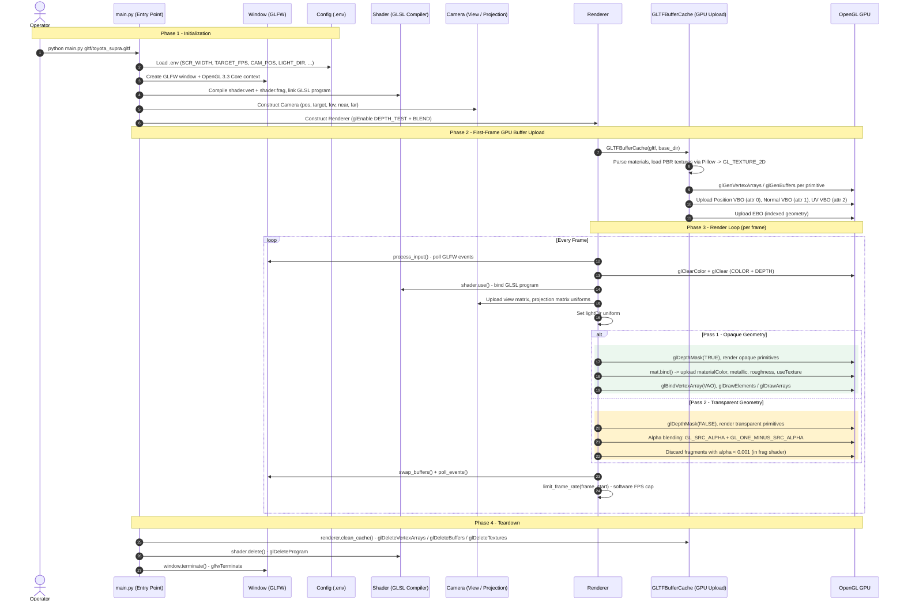
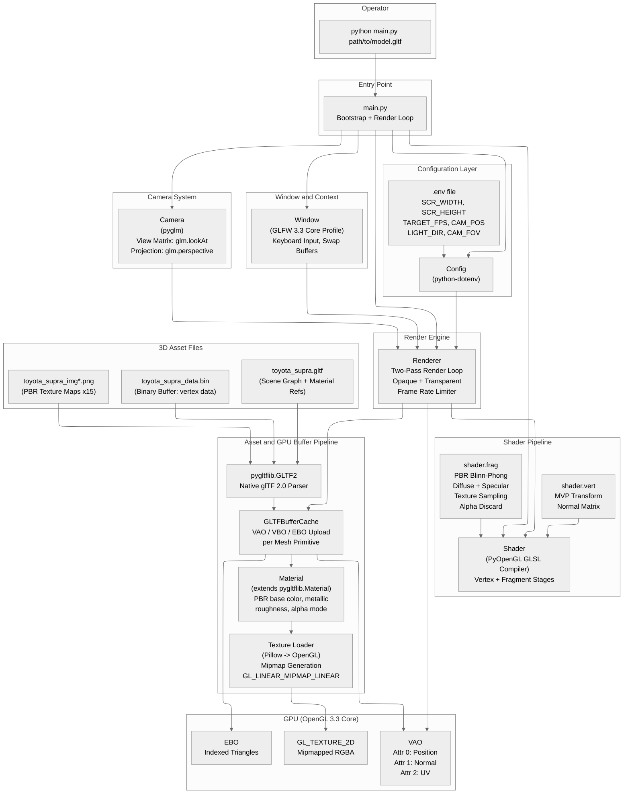
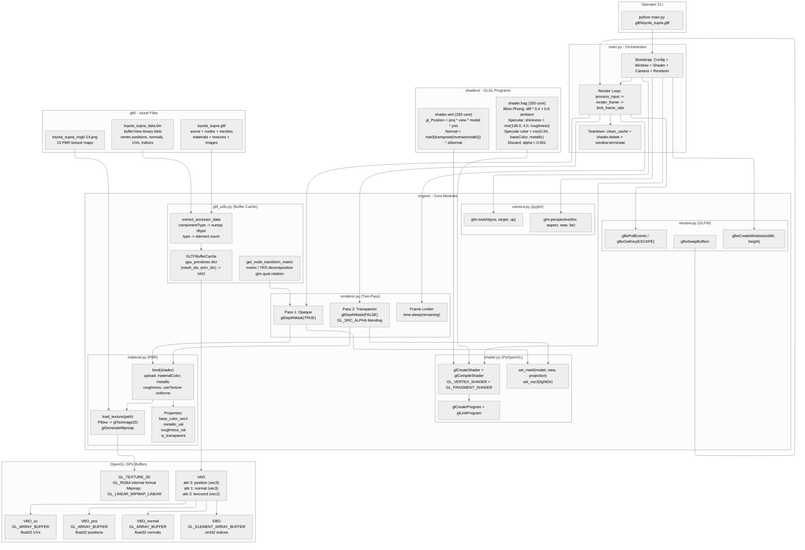

# PyGL-Renderer

> A modular, real-time 3D rendering engine written in Python — powered by native OpenGL and the glTF 2.0 standard.


A lightweight, zero-framework 3D graphics engine that reads industry-standard glTF 2.0 model files and renders them in real time using raw OpenGL draw calls — zero game engine overhead, full pipeline control.

---

## Core Purpose & Business Value

PyGL-Renderer is a ground-up, dependency-lean 3D renderer that bypasses the abstraction of high-level game engines. It is purpose-built for engineers and researchers who need precise control over every stage of the real-time rendering pipeline.

- **Full Pipeline Visibility**: Every render stage — from glTF buffer parsing to VAO upload, depth sorting, and shader dispatch — is explicit and inspectable. No black boxes.
- **Industry-Standard 3D Asset Support**: Loads any conformant glTF 2.0 scene file, including meshes, PBR materials, textures, and scene hierarchies, allowing real-world assets to be visualised without conversion.
- **Two-Pass Transparency Rendering**: Opaque and transparent primitives are sorted and drawn in separate GPU passes, ensuring correct alpha blending without visual artefacts.
- **Configurable Without Code Changes**: Camera position, field of view, window dimensions, target frame rate, and directional light can all be tuned via a `.env` file, making the renderer easy to embed in pipelines or demonstrations.
- **Predictable Frame Budget**: A software frame-rate limiter caps rendering to a configurable FPS ceiling, preventing CPU/GPU spin on fast hardware and enabling repeatable performance measurements.
- **Extensible Module Architecture**: The engine is split into focused, single-responsibility modules (`Window`, `Shader`, `Camera`, `Renderer`, `Material`, `GLTFBufferCache`) so any subsystem can be replaced or extended independently.

---

## System Architecture & Technical Execution

### Phase-by-Phase Rendering Execution Flow



---

### High-Level Engine Architecture



---

### Component Network & Data Flow Diagram



---

## Repository Structure

```
PYGL-RENDERER/
├── engine/
│   ├── __init__.py          # Public API: Config, Window, Shader, Camera, Renderer
│   ├── camera.py            # Camera: view + projection matrix generation (pyglm)
│   ├── config.py            # Config: environment-driven settings loader (python-dotenv)
│   ├── gltf_utils.py        # GLTFBufferCache: VAO/VBO/EBO GPU upload + accessor parser
│   ├── material.py          # Material: PBR properties + OpenGL texture lifecycle
│   ├── renderer.py          # Renderer: two-pass render loop + frame rate limiter
│   ├── shader.py            # Shader: GLSL compile/link/uniform setter
│   └── window.py            # Window: GLFW context + input + swap buffers
├── gltf/
│   ├── toyota_supra.gltf    # glTF 2.0 scene descriptor (JSON)
│   ├── toyota_supra_data.bin # Binary vertex/index buffer blob
│   └── toyota_supra_img*.png # 15 PBR texture maps
├── scripts/
│   └── load_supra.sh        # Convenience launcher for the Toyota Supra demo
├── shaders/
│   ├── shader.vert          # Vertex shader: MVP transform + normal matrix
│   └── shader.frag          # Fragment shader: Blinn-Phong PBR + alpha discard
├── .env                     # Runtime configuration (camera, window, light, FPS)
├── .gitignore
├── main.py                  # Application entry point + render loop orchestration
└── requirements.txt         # Python dependency manifest
```


## License

This project is licensed under the **MIT License**.
