# Antigravity 3D OpenGL Engine (`poc-renderer`)

Modular, high-performance 3D rendering pipeline built in Python with PyOpenGL, PyGLM, and GLFW, optimized for rendering glTF/GLB models.

## Architecture & Rendering Workflow

```mermaid
sequenceDiagram
    autonumber
    actor User
    participant App as main.py
    participant Config as engine.Config
    participant Window as engine.Window
    participant Renderer as engine.Renderer
    participant Shader as engine.Shader
    participant Mesh as engine.Mesh
    participant Camera as engine.Camera

    User->>App: Launch main.py [model_path]
    App->>Config: Load environment settings (.env)
    App->>Window: Initialize GLFW context & OpenGL 3.3 Core
    App->>Shader: Compile vertex & fragment shaders
    
    rect rgb(30, 45, 60)
        alt GLTF/GLB Model Available
            App->>Mesh: Load glTF geometry & textures via trimesh
        else Model File Missing
            App-->>User: Print error message & Exit(1)
        end
    end

    App->>Camera: Initialize 3D perspective camera
    App->>Renderer: Setup OpenGL depth testing & blending

    loop Render Loop
        App->>Window: Process input events
        App->>Renderer: render_frame(shader, mesh, camera)
        Renderer->>Shader: Upload Model, View, Projection matrices
        Renderer->>Mesh: Draw opaque & transparent primitives
        Renderer->>Window: Swap buffers & poll events
        Renderer->>Renderer: Limit frame rate (Target FPS)
    end

    App->>Mesh: Cleanup OpenGL VAO/VBO/Textures
    App->>Window: Terminate GLFW context
```



## Setup & Running

### 1. Prerequisites & Installation

```bash
# Clone the repository
git clone https://github.com/boycececil666/poc-renderer.git
cd poc-renderer

# Create virtual environment and install dependencies
python -m venv venv
source venv/Scripts/activate  # On Windows (Git Bash) or venv\Scripts\activate (PowerShell)
pip install -r requirements.txt
```

### 2. Run Renderer

```bash
# Launch with default Toyota Supra GLTF model
python main.py

# Or specify a custom 3D model
python main.py assets/models/custom_model.glb
```

## Project Structure

```
poc-renderer/
├── main.py                 # Application entry point
├── engine/                 # Modular 3D Rendering Engine core
│   ├── camera.py           # Camera view & perspective projection
│   ├── config.py           # Environment variable configuration loader
│   ├── material.py         # Texture loading & material properties
│   ├── mesh.py             # VAO/VBO buffer allocation & rendering
│   ├── renderer.py         # Render pipeline & FPS timing limiter
│   ├── shader.py           # GLSL shader program compilation
│   └── window.py           # GLFW context & window manager
├── gltf/                   # Toyota Supra 3D GLTF model & textures
├── shaders/                # GLSL shaders (shader.vert, shader.frag)
├── requirements.txt        # Python dependency manifest
└── README.md               # Project documentation
```
